# Microsoft Entra ID for Customers, Custom Claim Provider Sample for ASP.NET Core.
## Why this sample?

The guide "[Get started with custom claims providers (preview)](https://learn.microsoft.com/en-us/entra/identity-platform/custom-extension-get-started?context=%2Fentra%2Fexternal-id%2Fcustomers%2Fcontext%2Fcustomers-context)" describes how to configure and set up a custom claims provider with the [token issuer start event](https://learn.microsoft.com/en-us/entra/identity-platform/custom-claims-provider-overview#token-issuance-start-event-listener). This sample extends the existing sample by providing a guide, together with sample code, for how to configure and set up a customer claims provider by creating an [ASP.NET Core](https://learn.microsoft.com/en-us/aspnet/core/introduction-to-aspnet-core?view=aspnetcore-8.0) based API utilizing [Identity.Web](https://learn.microsoft.com/en-us/entra/msal/dotnet/microsoft-identity-web/).

## Prerequisites

The sample relies on:

- [ASP.NET Core 8](https://dotnet.microsoft.com/en-us/download/dotnet/8.0)
- [Microsoft Visual Studio 2022](https://visualstudio.microsoft.com/vs/community/). The guide is written from the assumption that you are using  version 17.8 or later, although it should work equally fine using Visual Studio Code.
- Third party service [ngrok](https://ngrok.com/). The sample relies on [ngrok](https://ngrok.com/) for exposing the API, while running it on your local machine, as a public endpoint, which is accessible for your Microsoft Entra ID for Customers Identity Provider. 

ngrok have a free service offering that unfortunately cannot be used here as the Microsoft Entra ID for customer custom authentication extension require a TLS endpoint - i.e., free ngrok offers only http, not https. 

If you don't have an a ngrok account and do not want to invest in the service, you have at least two obvious choices: 

1. You can use another service similar to ngrok. Please search the web for ngrok alternatives, there're plenty. 
2. You can deploy the API to an Azure App Services. To debug in this scenario, you can leverage [Azure App Service remote debugging](https://learn.microsoft.com/en-us/visualstudio/debugger/remote-debugging-azure-app-service?view=vs-2022).

## Step 1: Setting up

1. To run the sample; start by making a a fork of the repo for your own GitHub account. Then clone the repo from your GitHub account to your local dev machine.

2. To run the sample on your local dev machine, you're going to need a public end-point for the API that the Microsoft Entra ID for customers Identity Provider can access. For this we're using the 3rd party tool ngrok. 
   Assuming that you've installed and configured ngrok already, you can fire up a public endpoint with this command from the command prompt:
   
   ```bash 
   ngrok http --region=eu --domain=entra-ext1.eu.ngrok.io https://localhost:7047
   ```
   
   The result looks something like this:
   
   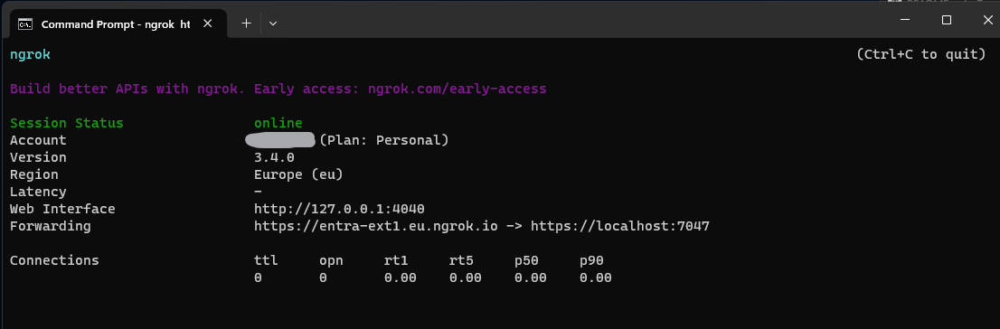
   You can also add your public end-point to your `ngrok.yml`: 
   
   ```yaml 
   authtoken: <your auth token> #don't change your auth token. Go to dashboard.ngrok.com if it's missing. 
   region: eu #change this to your region.
   tunnels:
   	#... existing tunnels migth be here.
       entra:
           proto: http
           hostname: entra-ext1.eu.ngrok.io #pick your dns name. Must end on .<region>.ngrok.io.
           addr: https://localhost:7047 #the url for the API running on your local developer machine.
           schemes:
               - https
   version: "2"
   ```
   
   > Note: For more see the [ngrok documentation](https://ngrok.com/docs/).

## Step 2: Create an Entra ID for Customers Tenant

Create a dedicated tenant for your customer scenarios. The steps for creating a dedicated tenant are outlined here in the documentation for Microsoft Entra ID for customers: [Overview - Customer identity access management (CIAM) | Microsoft Learn](https://learn.microsoft.com/en-us/entra/external-id/customers/overview-customers-ciam#create-a-dedicated-tenant-for-your-customer-scenarios). Please follow these steps to set up a dedicated tenant for this sample.

## Step 3: Configure Entra ID for Customers

> Note: These steps are a slightly revised version of this guide: [Get started with custom claims providers (preview) - Step 2: Register a customer authentication extension](https://learn.microsoft.com/en-us/entra/identity-platform/custom-extension-get-started?context=%2Fentra%2Fexternal-id%2Fcustomers%2Fcontext%2Fcustomers-context&tabs=microsoft-graph%2Ccsharp#step-2-register-a-custom-authentication-extension).

### Step 3.1: Register customer authentication extension

1. Sign in to the [Microsoft Entra admin center](https://entra.microsoft.com/) as at least an [Application Administrator](https://learn.microsoft.com/en-us/entra/identity/role-based-access-control/permissions-reference#application-developer) and [Authentication Administrator](https://learn.microsoft.com/en-us/entra/identity/role-based-access-control/permissions-reference#authentication-administrator).
2. Browse to **Identity** > **External Identities** > **Customer authentication extensions**.
3. Select **+ Create a custom authentication extension**.
4. In **Basics**, select the **TokenIssuanceStart** event and select **Next**.
5. In **Endpoint Configuration**, fill in the following properties:
   - **Name** - A name for your custom authentication extension. For example, *Token issuance event*.
   - **Target Url** - The `{hostname}` of your ngrok endpoint - For example *https://entra-ext1.eu.ngrok.io/api/CustomClaim*. *Note: ngrok will be setup in a later step*
   - **Description** (optional) - A description for your custom authentication extensions.
6. Select **Next**.
7. In **API Authentication**, select the **Create new app registration** option to create an app registration that represents your *function app*.
8. Give the app a name, for example **ASP.NET API authentication events API**.
9. Select **Next**.
10. In **Claims**, enter the attributes that you expect your custom authentication extension to parse from your REST API and will be merged into the token. Add the following claims:
    - `dateOfBirth`
    - `customRoles`
    - `apiVersion`
    - `correlationId`
11. Select **Next** and **Create**, which registers the custom authentication extension and the associated application registration.

### Step 3.2: Grant Admin Consent

1. After your custom authentication extension is created, open the **Overview** tab of the new custom authentication extension a wait a few seconds for the setup of the extension to complete.

2. When the extension set has completed, select the **Grant permission** button to give admin consent to the registered app, which allows the custom authentication extension to authenticate to your API. The custom authentication extension uses `client_credentials` to authenticate to the Azure Function App using the `Receive custom authentication extension HTTP requests` permission. 

   > Note: during the preview the grant permission flow sometimes get stuck with `redirecting...`. You can wait a few seconds and ignore this

The following screenshot shows how to grant permissions.

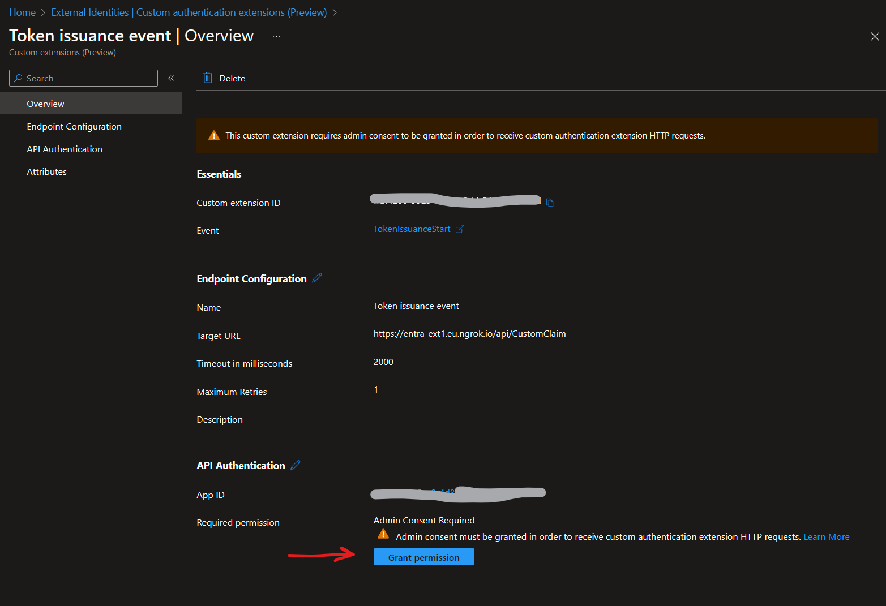

### Step 3.3: Note Down the App Id for the Extension

1. From the API Authentication page look to the summary section and note down value of App ID: 

   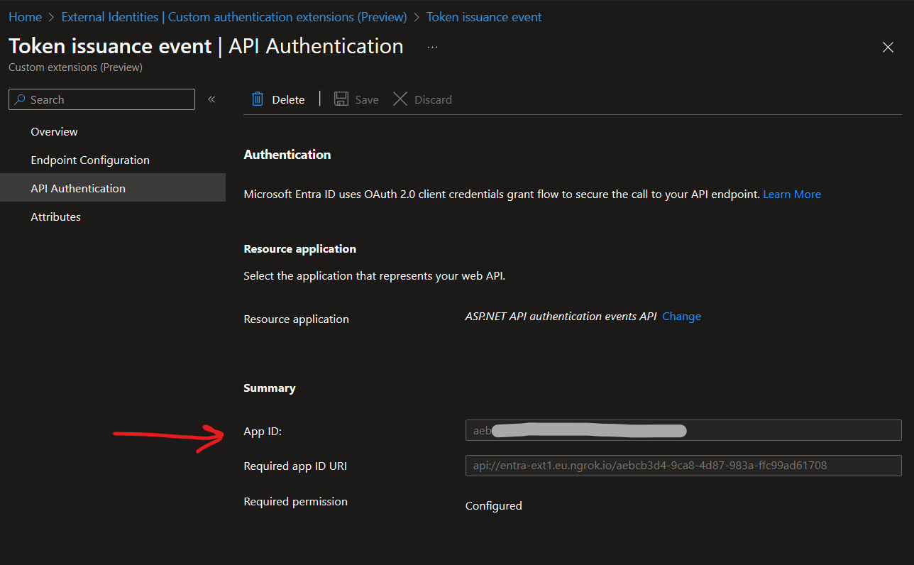

## Step 4: Add configuration to appsettings.json

If you haven't already, start by cloning this repo to your local dev environment.

### Step 4.1

We need two values to continue:

- The `App ID`, is the value you already noted down in step 3.3. 
- The `Tenant ID` (aka. Directory ID) of your Microsoft Entra ID for customers tenant.

To get the Tenant ID follow these steps:

1. Sign in to the [Microsoft Entra admin center](https://entra.microsoft.com/) as at least an [Application Administrator](https://learn.microsoft.com/en-us/entra/identity/role-based-access-control/permissions-reference#application-developer).

2. Browse to **Identity** > **Applications** > **Application registrations**.

3. Click **View all applications in the directory**

4. Choose the display name of the extension you just created. For example **ASP.NET API authentication events API**.

5. You'll find the Tenant ID here: 

   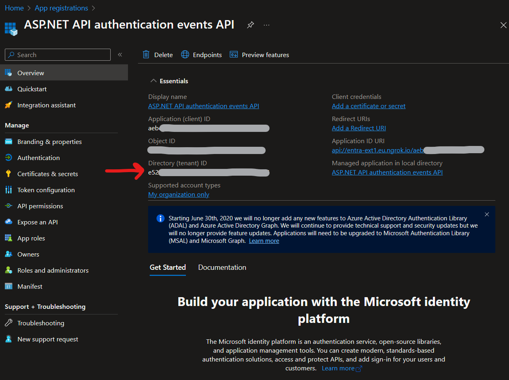

### 4.2: Configuring `appsettings.json`

Before we can run the sample, we need to add the configuration to the `appsettings.json`file (*)

1. Rename the file `appsettings.temp.json` to `appsettings.json`. It now looks like this.

```json 
{
  "Logging": {
    "LogLevel": {
      "Default": "Information",
      "Microsoft.AspNetCore": "Warning"
    }
  },
  "Entra": {
    "AuthorizedParty": [
      "99045fe1-7639-4a75-9d4a-577b6ca3810f"
    ],
    "Authority": "https://login.microsoftonline.com/{{Entra ID tenant id}}/v2.0", //<-- add here
    "Instance": "https://login.microsoftonline.com/",
    "TenantId": "{{Entra ID tenant id}}", //<-- add here
    "Audience": "{{App ID of custom autentication app}}" //<-- add here
  },
  "AllowedHosts": "*"
}
```

2. Add the missing values `App ID` and `Tenant ID` to the app settings file. The result should now look something like this: 

```json
{
  "Logging": {
    "LogLevel": {
      "Default": "Information",
      "Microsoft.AspNetCore": "Warning"
    }
  },
  "Entra": {
    "AuthorizedParty": [
      "99045fe1-7639-4a75-9d4a-577b6ca3810f"
    ],
    "Authority": "https://login.microsoftonline.com/e524444-bbbb-5555-cccc-777777777777/v2.0",
    "Instance": "https://login.microsoftonline.com/",
    "TenantId": "e524444-bbbb-5555-cccc-777777777777",
    "Audience": "aeb1111-aaaa-bbbb-2222-333333333333"
  },
  "AllowedHosts": "*"
}
```

## Step 5: Configure an OpenID Connect app to receive enriched tokens

To get a token and test the custom authentication extension API, you can use the [https://jwt.ms](https://jwt.ms/) app. It's a Microsoft-owned web application that displays the decoded contents of a token (the contents of the token never leave your browser).

Follow these steps to register the **jwt.ms** web application:

### 5.1 Register a test web application

1. Sign in to the [Microsoft Entra admin center](https://entra.microsoft.com/) as at least an [Application Administrator](https://learn.microsoft.com/en-us/entra/identity/role-based-access-control/permissions-reference#application-developer).
2. Browse to **Identity** > **Applications** > **Application registrations**.
3. Select **New registration**.
4. Enter a **Name** for the application. For example, **My Test application**.
5. Under **Supported account types**, select **Accounts in this organizational directory only**.
6. In the **Select a platform** dropdown in **Redirect URI**, select **Web** and then enter `https://jwt.ms` in the URL text box.
7. Select **Register** to complete the app registration.

The following screenshot shows how to register the *My Test application*.

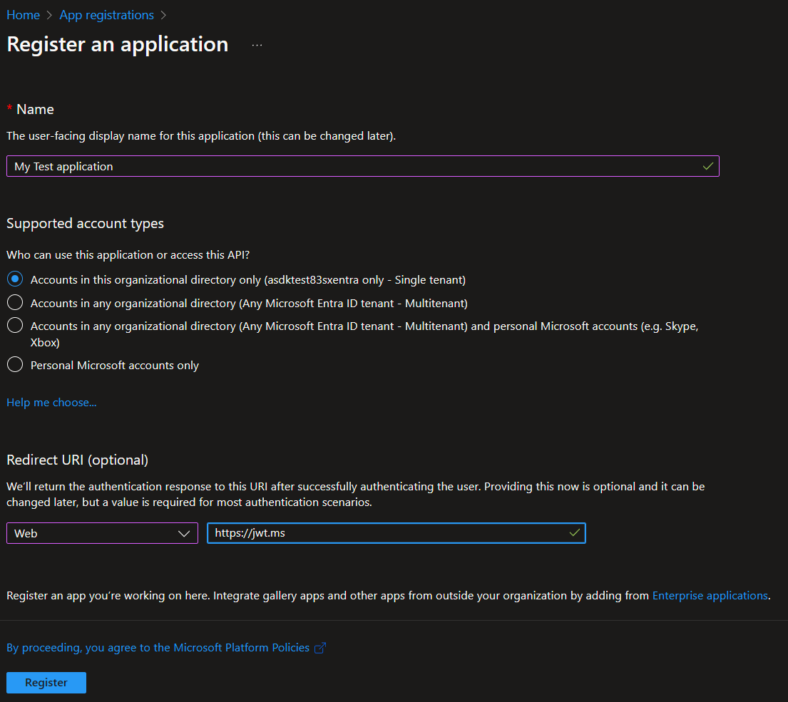

### 5.2 Get the application ID

In your app registration, under **Overview**, copy the **Application (client) ID**. The app ID is referred to as the `{the_jwt_app_id}` in later steps.

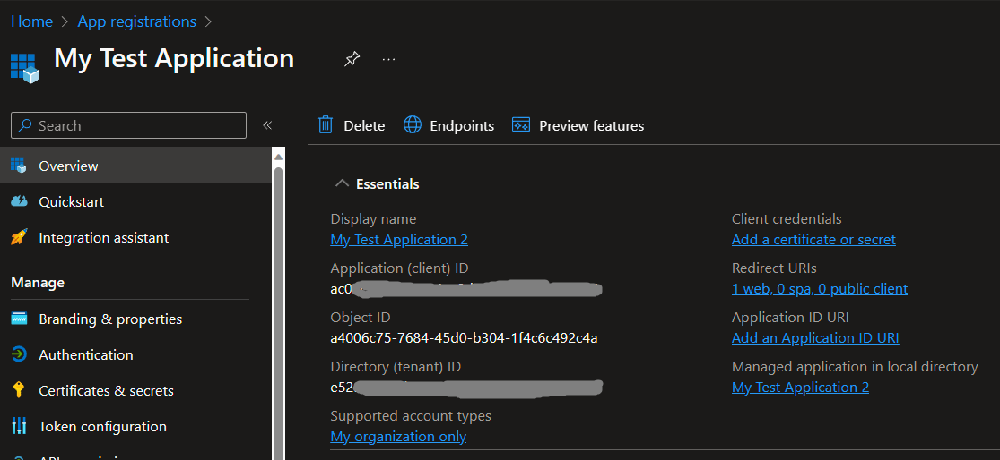

### 5.3 Enable implicit flow

The **jwt.ms** test application uses the implicit flow. Enable implicit flow in your *My Test application* registration:

1. Under **Manage**, select **Authentication**.
2. Under **Implicit grant and hybrid flows**, select the **ID tokens (used for implicit and hybrid flows)** checkbox.
3. Select **Save**.

> Note: Implicit flow is used here for testing and illustration purposes. Avoid using the implicit flow in production: [Microsoft identity platform and OAuth 2.0 implicit grant flow | Microsoft Learn](https://learn.microsoft.com/en-us/entra/identity-platform/v2-oauth2-implicit-grant-flow#prefer-the-auth-code-flow).

### 5.4 Enable your App for claims mapping policy

A claims mapping policy is used to select which attributes returned from the custom authentication extension are mapped into the token. To allow tokens to be augmented, you must explicitly enable the application registration to accept mapped claims:

1. In your *My Test application* registration, under **Manage**, select **Manifest**.
2. In the manifest, locate the `acceptMappedClaims` attribute, and set the value to `true`.
3. Set the `accessTokenAcceptedVersion` to `2`.
4. Select **Save** to save the changes.

The following JSON snippet demonstrates how to configure these properties.

```json
{
  "acceptMappedClaims": true,
  "accessTokenAcceptedVersion": 2,
  "appId": "ac022222-0000-0000-0000-000000000000",
}
```

> **Warning**: Do not set `acceptMappedClaims` property to `true` for multi-tenant apps, which can allow malicious actors to create claims-mapping policies for your app. Instead [configure a custom signing key](https://learn.microsoft.com/en-us/graph/application-saml-sso-configure-api#option-2-create-a-custom-signing-certificate).

## Step 6: Assign a Custom Claims Provider to Your App

For tokens to be issued with claims incoming from the custom authentication extension, you must assign a custom claims provider to your application. This is based on the token audience, so the provider must be assigned to the client application to receive claims in an ID token, and to the resource application to receive claims in an access token. The custom claims provider relies on the custom authentication extension configured with the **token issuance start** event listener. You can choose whether all, or a subset of claims, from the custom claims provider are mapped into the token.

Follow these steps to connect the *My Test application* with your custom authentication extension:

### 6.1  Configure custom claims provider

First assign the custom authentication extension as a custom claims provider source:

1. Sign in to the [Microsoft Entra admin center](https://entra.microsoft.com/) as at least an [Application Administrator](https://learn.microsoft.com/en-us/entra/identity/role-based-access-control/permissions-reference#application-administrator).
2. Browse to **Identity** > **Applications** > **Enterprise applications**.
3. In the **Overview** page, under **Managed application in local directory**, select **My Test application**.
4. Under **Manage**, select **Single sign-on**.
5. Under **Attributes & Claims**, select **Edit**.
   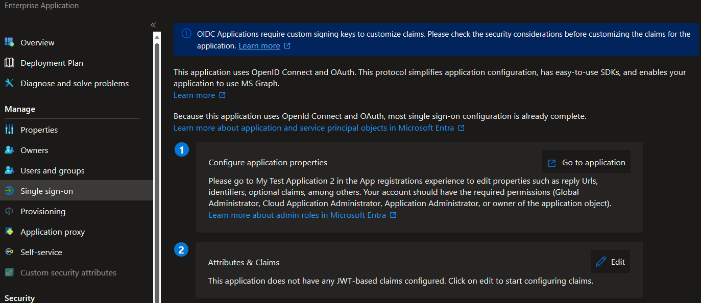
6. Expand the **Advanced settings** menu.
7. Select **Configure** against **Custom claims provider**.
8. Expand the **Custom claims provider** drop-down box, and select the *Token issuance event* you created earlier.
9. Select **Save**.

### 6.2  Add new claims

Next, assign the attributes from the custom claims provider, which should be issued into the token as claims:

1. Select **Add new claim** to add a new claim. Provide a name to the claim you want to be issued, for example **dateOfBirth**.
2. Under **Source**, select `Attribute`, and choose `customClaimsProvider.DateOfBirth` from the **Source attribute** drop-down box.
   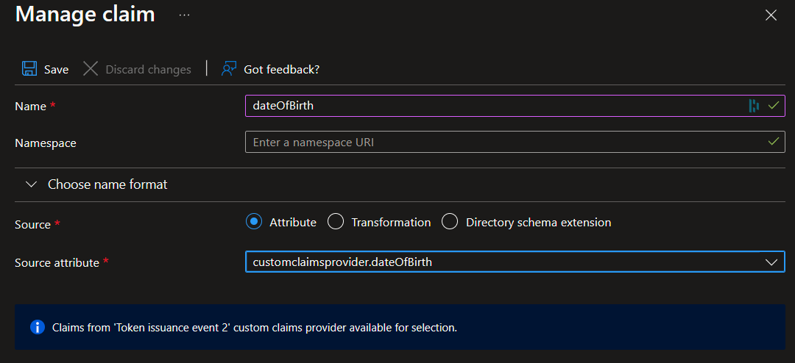
3. Select **Save**.
4. You can repeat this process to add the other three attributes: 
   - `customClaimsProvider.customRoles`
   - `customClaimsProvider.apiVersion` 
   - `customClaimsProvider.correlationId`

## Step 7: Test the application (jwt.ms)

To test your custom claim provider, follow these steps:

1. Open a new private browser and navigate and sign-in through the following URL.
   ```http
   https://login.microsoftonline.com/{tenant_id}/oauth2/v2.0/authorize?client_id={the_jwt_app_id}&response_type=id_token&redirect_uri=https://jwt.ms&scope=openid&state=12345&nonce=12345
   ```

   

2. Replace `{tenant_id}` with your tenant ID, tenant name, or one of your verified domain names. For example, `contoso.onmicrosoft.com`.

3. Replace `{the_jwt_app_id}` with the [My Test application registration ID](https://learn.microsoft.com/en-us/entra/identity-platform/custom-extension-get-started?context=%2Fentra%2Fexternal-id%2Fcustomers%2Fcontext%2Fcustomers-context&tabs=entra-admin-center%2Ccsharp#31-get-the-application-id).

4. After logging in, you'll be presented with your decoded token at `https://jwt.ms`. Validate that the claims from the Azure Function are presented in the decoded token, for example, `dateOfBirth`.

## Step 8 (optional): Debugging the custom extensions API 

If you set a debugging breakpoints in the API code, the process described in step 7 above will fail as you run the http request. The Entra ID identity provided will detect the delay in the response and the authentication will be interrupted. For more details see: [Troubleshoot a custom claims provider - Microsoft identity platform | Microsoft Learn](https://learn.microsoft.com/en-us/entra/identity-platform/custom-extension-troubleshoot)

To attach a debugger to the API, we need a way to test the API without involving Entra ID. To accommodate testing and debugging the `appsettings.json` in the sample code defines `AuthorizedParty`as an array:

````json
...
  },
  "Entra": {
    "AuthorizedParty": [
      "99045fe1-7639-4a75-9d4a-577b6ca3810f", // <- this is all we need for production
      "{{2nd authorized party for testing (GUID)}}" // <- this is for testing/debugging purposes only.
    ],
...
````

By adding a second authorized party, we can obtain a valid access token for this authorized party and use this to test the API. 

### 8.1 Setting up for debugging

Let's use the `My Test Application` as authorized party:

1. Add `{the_jwt_app_id}` to the  `AuthorizedParty` array:
   ```json
   "AuthorizedParty": [
         "99045fe1-7639-4a75-9d4a-577b6ca3810f", // <- this is all we need for production
         "ac022222-0000-0000-0000-000000000000" // <- replace with the {the_jwt_app_id} guid
       ],
   ```

2. Create a [.http file](https://learn.microsoft.com/en-us/aspnet/core/test/http-files?view=aspnetcore-8.0) in your Visual Studio project by renaming the file `test.temp.http` to `test.http` in the `Http` directory in:
   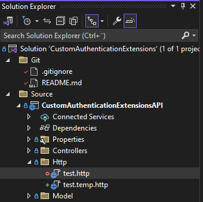

3. The .http file include some variable that we need to specify. We will do this in the following steps.

> Note: For more about using the .http file this short video by Mads Kristensen can be highly recommended: [New .http file support in Visual Studio 2022](https://youtu.be/ud0wx5mgniI?si=MVhT_tBQgqZ8ZIlG).

### 8.2 Obtaining an access token for  `My test application` 

Your REST API is protected by a Microsoft Entra access token. You can test your API by obtaining an access token. After you acquire an access token, pass it the HTTP `Authorization` header. To obtain an access token, follow these steps

1. Sign in to the [Microsoft Entra admin center](https://entra.microsoft.com/) as at least an [Cloud Application Administrator](https://learn.microsoft.com/en-us/entra/identity/role-based-access-control/permissions-reference#cloud-application-administrator).

2. Browse to **Identity** > **Applications** > **Application registrations**.

3. Click *View all applications in the directory*

4. Select the *My Test Application 2* app registration [you created previously](https://learn.microsoft.com/en-us/entra/identity-platform/custom-extension-get-started#step-2-register-a-custom-authentication-extension) for jwt.ms.

5. If you haven't created an app secret, follow these steps:

   1. Select **Certificates & secrets** > **Client secrets** > **New client secret**.
   2. Add a description for your client secret.
   3. Select an expiration for the secret or specify a custom lifetime.
   4. Select **Add**.
   5. Record the **secret's value** for use in your client application code. This secret value is never displayed again after you leave this page.

6. Fill out the first set of variables in the .http file you renamed in 8.1:
   ```http
   # For more info on HTTP files go to https://aka.ms/vs/httpfile
   
   ### Get bearer token for app
   @tenantId=<Tenant Id>
   @clientId=<Client Id | {the_jwt_app_id} >
   @clientSecret=<Secret's value>
   @audience=<client id of the extension>
   @api_host=<api host name>
   @scope=<api://{{api_host}}/{{audience}}/.default>
   ```

   The result should look something like this:

   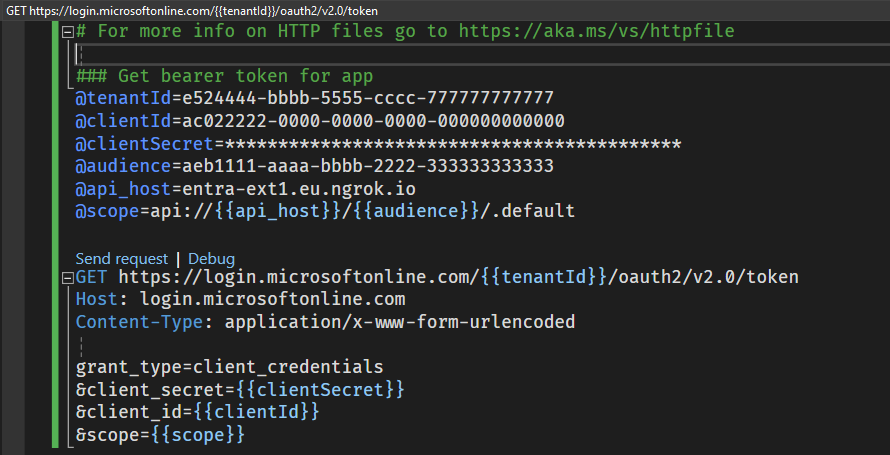

   ### 8.3 Obtaining Access Token

1. Click **Send request** above the `GET https://login.microsoftonline.com/...` command.
2. If send request is successful you should now see a result like this:
   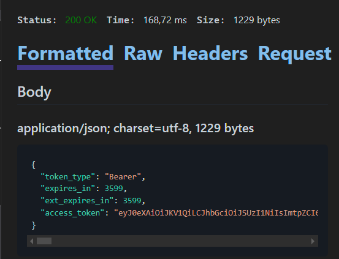
3. Copy the value of `access_token` without the quotes - i.e., the value: `eyj0eXAiOiJKV1QiLCJ....`'

### 8.4  Call extension authorization API with the access token

1. Copy the access token string to the `@access_token` variable for the `POST {{localUrl}}/api/CustomClaim` http request.
2. The result should now look like this:
   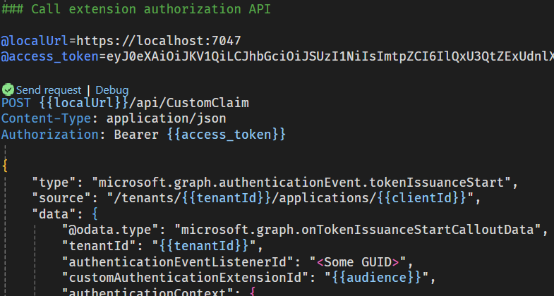
3. To run the http send request for `POST {{localUrl}}/api/CustomClaim` :
   1. Run (F5) the Visual Studio project.
   2. When the project is running, press **Send request**.
4. The result should look like this:
   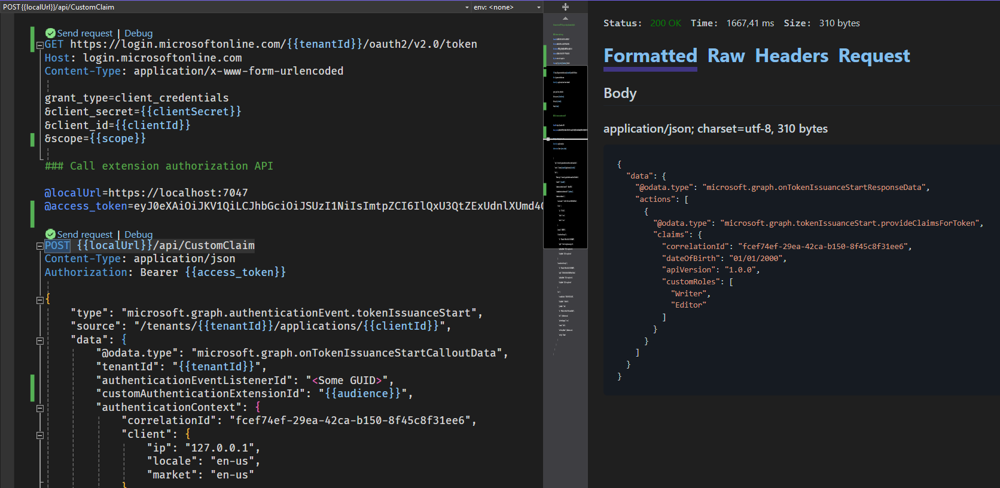

> Note: For more details about the json payload see here: [Custom claims provider reference - Microsoft identity platform | Microsoft Learn](https://learn.microsoft.com/en-us/entra/identity-platform/custom-claims-provider-reference)

## Notes

(*) In a production environment the app setting values in `appsettings.json` should likely be defined as environment values in Azure App Services, or even better stored in [Azure App Configuration](https://learn.microsoft.com/en-us/azure/azure-app-configuration/overview), for proper configurations management.
